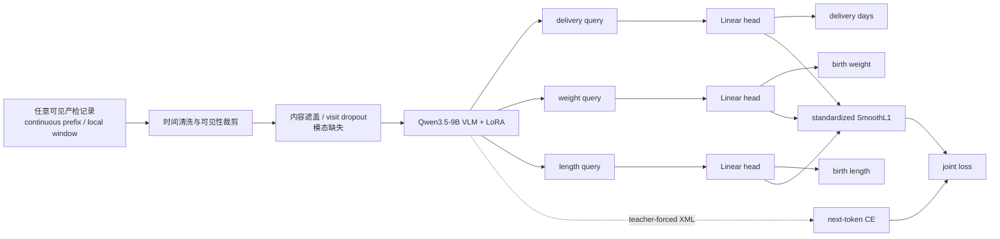
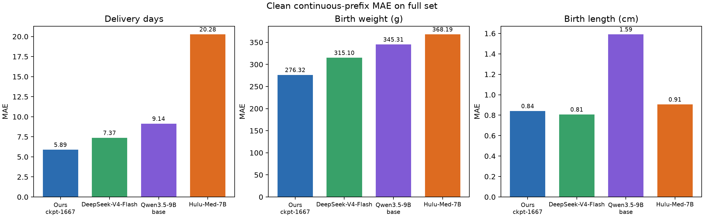
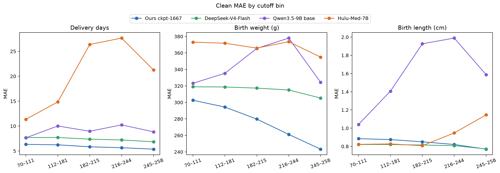
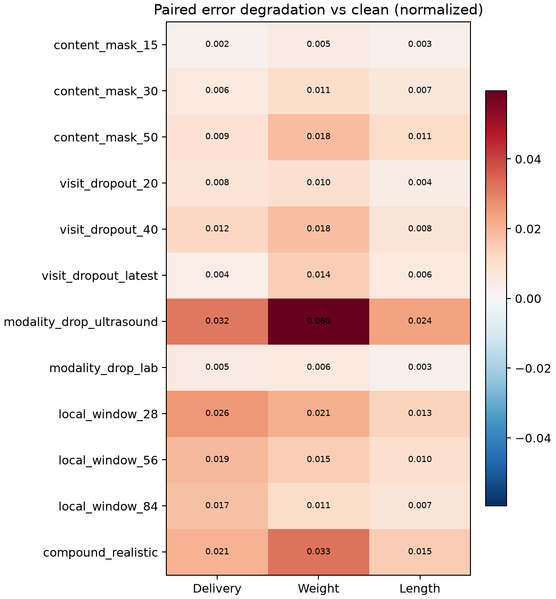

<div align="center">

# Temporal Perinatal Outcome VLM

**Leakage-safe continuous temporal modeling for delivery day, birth weight, and birth length**

[](https://www.python.org/)
[](https://pytorch.org/)
[](https://huggingface.co/docs/transformers/)
[](https://github.com/modelscope/ms-swift)
[](.github/workflows/ci.yml)

中文说明 · Source-only release · Weights hosted separately on Hugging Face

</div>

---

这个仓库整理自 continuous-v2 最终实验版本。它将不规则、可缺失的纵向产检记录建模为任意时间窗口，在 Qwen3.5-9B VLM 上进行 LoRA SFT，并通过三个 outcome query token 的 hidden state 直接回归：

- 最终分娩孕周天数（DaysFromLMP）
- 出生体重（g）
- 出生体长（cm）

核心动机很简单：next-token CE 能学习“数字字符串是否正确”，却没有显式的连续距离结构。这里保留语言建模 CE，同时加入标准化 SmoothL1 数值损失，让模型既保持自然语言/VLM 接口，又对数值误差敏感。

> [!IMPORTANT]
> 仓库只发布方法、脚本、聚合指标与无个体信息的图表。真实临床 JSONL、患者级预测、日志和模型权重均不会进入 Git。代码仅供研究，不构成医疗建议或临床决策系统。

## 方法概览



联合目标为：

$$
\mathcal{L}
= \lambda_{\mathrm{CE}}\mathcal{L}_{\mathrm{CE}}
+ \lambda_{\mathrm{reg}}\frac{1}{|\mathcal{T}_{valid}|}
\sum_{t\in\mathcal{T}_{valid}}
\operatorname{SmoothL1}\left(
\hat z_t,\frac{y_t-\mu_t}{s_t};\beta=0.5
\right).
$$

实验中 `λCE = 1`、`λreg = 1`；三个任务的中心/尺度分别为 `(275 d, 3250 g, 50 cm)` 和 `(10 d, 500 g, 2 cm)`。无效的可选标签使用 `outcome_mask` 屏蔽，不参与回归损失；delivery day 必须有效。

更多实现细节见 [METHOD.md](docs/METHOD.md)。

## Continuous-v2 数据策略

训练不再显式区分 canonical landmark 与 continuous prefix。97/160/202/230/258 仅作为每个时间分箱的采样 anchor，而不是固定训练视图。

| 设计项 | 最终配置 |
|---|---|
| 训练抽样 | 80,000 个确定性 draws |
| 队列平衡 | Huaxi : Shenzhen = 1 : 1 |
| cutoff bins | 70–111 / 112–181 / 182–215 / 216–244 / 245–258 天 |
| cutoff 密度 | 35% anchor-centered triangular + 65% uniform |
| 输入条件 | 60% clean prefix / 20% content mask / 10% visit dropout / 10% local window |
| 覆盖约束 | 每个训练病例至少有一个 clean continuous prefix |
| tail balance | 三个结局边缘分布的几何均值权重，最大 3× |
| validation | 256 个完全 held-out 病例 × 5 个非 anchor cutoff = 1,280 rows |

数据构建阶段会：

- 删除分娩后记录，并强制 `cutoff_day < delivery_days`
- 过滤 0 值、非有限值、异常量纲与跨字段不合理标签
- 去除由最终结局生成的摘要、软提示与建模辅助提示
- 保留项目约定的 Huaxi seen-test 特例，但不把 test 文件再次拼入训练集
- 将 benchmark 的临床输入与标签分开保存；私有 query token 只在运行时注入

完整输入契约见 [DATA.md](docs/DATA.md)。

## 结果快照

下表来自 full model-agnostic clean continuous-prefix split，使用 checkpoint-1667 的原始三头输出，不包含任何基于 ground truth 的事后修正。

| 模型 | Delivery MAE ↓ | Weight MAE ↓ | Length MAE ↓ | 覆盖率 |
|---|---:|---:|---:|---:|
| **Continuous-v2 (ours)** | **5.891 d** | **276.3 g** | 0.841 cm | 100% |
| DeepSeek-V4-Flash | 7.371 d | 315.1 g | **0.808 cm** | 100% |
| Qwen3.5-9B base | 9.142 d | 345.3 g | 1.591 cm | ≥99.7% |
| Hulu-Med-7B | 20.278 d | 368.2 g | 0.906 cm | 88.8–99.5% |



随着 cutoff 后移，ours 的 clean delivery MAE 从 6.336 d 降至 5.372 d；群体指标满足“更多纵向信息带来更精确预测”的目标，而不强制每个病例逐点单调。



模型在 content mask、visit dropout、modality drop、local window 和 compound missingness 下保持较小的成对误差增量，同时预测会随实际可见内容发生非零漂移。



结果、适用范围与限制见 [RESULTS.md](docs/RESULTS.md)。Huaxi seen-test 属于训练可见特例，不能解释为独立外部泛化。

## 仓库结构

```text
.
├── plugins/
│   └── outcome_regression.py       # Qwen3.5 三 query token + 三数值头 + joint loss
├── scripts/
│   ├── build_dataset.py            # continuous-v2 训练/验证集
│   ├── train.sh                    # 4-GPU ms-swift LoRA SFT
│   ├── smoke_train.sh              # 4-step 冒烟训练
│   ├── build_benchmark.py          # model-agnostic paired benchmark
│   ├── audit_benchmark.py          # 泄露、配对与扰动语义审计
│   ├── run_inference.py            # ours 与生成式 VLM baseline
│   ├── analyze_predictions.py      # MAE、漂移、robustness 与可视化
│   └── select_checkpoint.py        # 群体趋势优先的 checkpoint selector
├── src/temporal_outcome/
│   ├── data/                       # 清洗、时间裁剪、增强与平衡
│   └── benchmark/                  # 运行时 renderer
├── configs/train.env.example
├── docs/
├── tests/
└── assets/                         # 仅聚合图，无患者级数据
```

## 快速开始

### 1. 安装

```bash
git clone <your-github-repository>
cd temporal-perinatal-outcome-vlm
python -m pip install -e ".[train,analysis,dev]"
```

训练插件还需要兼容 Qwen3.5 的 ms-swift。正式实验环境为 ms-swift `4.4.0.dev0`；建议使用同一提交或等价版本的源码 checkout，并设置 `MS_SWIFT_ROOT`。完整版本信息见 [REPRODUCIBILITY.md](docs/REPRODUCIBILITY.md)。

### 2. 准备私有源数据

```text
/private/source-data/
├── huaxi/
│   ├── huaxi_train.jsonl
│   └── huaxi_test.jsonl
└── shenzhen/
    ├── shenzhen_train_all__full.jsonl
    └── shenzhen_internal_test_all__full.jsonl
```

```bash
python scripts/build_dataset.py \
  --source-root /private/source-data \
  --draws 80000
```

生成物默认写入 `data/`，已被 `.gitignore` 全量排除。

### 3. 先做 smoke test

```bash
export MS_SWIFT_ROOT=/path/to/ms-swift
export MODEL_PATH=/path/to/Qwen3.5-9B
bash scripts/smoke_train.sh
```

### 4. 正式训练

```bash
export MS_SWIFT_ROOT=/path/to/ms-swift
export MODEL_PATH=/path/to/Qwen3.5-9B
export CUDA_VISIBLE_DEVICES=0,1,2,3
export NPROC_PER_NODE=4
bash scripts/train.sh
```

默认复现实验为 1 epoch、LoRA rank 128、bf16、ZeRO-2、有效 batch size 48。所有关键参数均可通过环境变量覆盖；参考 [train.env.example](configs/train.env.example)。

## 构建与评估 robustness benchmark

```bash
python scripts/build_benchmark.py \
  --source-root /private/source-data

python scripts/audit_benchmark.py \
  --root benchmarks/model_agnostic_robustness_v1 \
  --output benchmarks/model_agnostic_robustness_v1/audit_report.json
```

以 4 卡对 ours 做 full split 推理：

```bash
torchrun --nproc_per_node 4 scripts/run_inference.py \
  --model ours \
  --split full \
  --ours-base /path/to/Qwen3.5-9B \
  --ours-checkpoint /path/to/checkpoint \
  --output-dir evaluation/benchmark_run

python scripts/analyze_predictions.py \
  --benchmark-root benchmarks/model_agnostic_robustness_v1 \
  --output-dir evaluation/benchmark_run \
  --model-label continuous-v2
```

普通 VLM baseline 读取完全相同的 `test.jsonl`；只有 ours renderer 会在内存中追加三个 query token。见 [BENCHMARK.md](docs/BENCHMARK.md)。

## 权重

权重不在本仓库中。将 LoRA adapter、`outcome_regression` 模块和必要 tokenizer 文件上传到 Hugging Face 后，可把模型地址填写在此处：

```text
Hugging Face: <your-org>/<your-model-repo>
Base model:   Qwen3.5-9B
```

## 复现边界

- 原始数据是私有临床数据，因此公开仓库无法单独复现论文级数值。
- 数值头当前仍存在向群体均值收缩的现象；MAE 明显改善不等于个体相关性已经充分。
- 群体平均误差的时间单调性是模型选择指标，个体逐点单调性仅作诊断。
- benchmark 的“预测稳定”必须与 clean accuracy、correlation 和 prediction drift 一起解释；恒定输出也可能看似稳定。
- 本仓库不发布含患者文本、case ID、原始预测或可逆元数据的文件。

---

<div align="center">
Built for temporal compatibility, numeric sensitivity, and leakage-aware evaluation.
</div>
