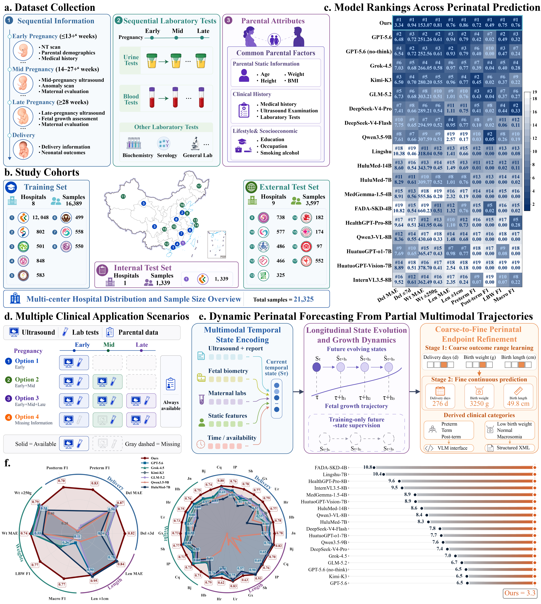
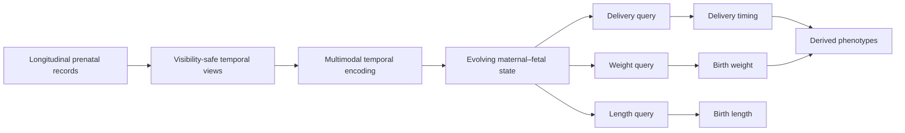

<div align="center">

<h1>FetusGrowth</h1>

<h3>Longitudinal Multimodal Modeling of Fetal Growth<br/>for Perinatal Outcome Prediction</h3>

<p>
  A leakage-aware research framework that turns irregular prenatal trajectories into
  continuously updated predictions of delivery timing, birth weight, and birth length.
</p>

<p>
  <a href="https://www.python.org/"></a>
  <a href="https://pytorch.org/"></a>
  <a href="https://github.com/modelscope/ms-swift"></a>
  <a href="https://huggingface.co/docs/transformers/"></a>
</p>

<p>
  
  
  
  
  
</p>

<p>
  <a href="#overview">Overview</a> &bull;
  <a href="#study-at-a-glance">Study</a> &bull;
  <a href="#method">Method</a> &bull;
  <a href="#quick-start">Quick Start</a> &bull;
  <a href="#basic-operations">Operations</a> &bull;
  <a href="#reproducibility-and-safety">Safety</a>
</p>

</div>

---

> [!IMPORTANT]
> This repository is a **source-only research release**. It does not include clinical
> records, patient-level predictions, training logs, checkpoints, or model weights.
> FetusGrowth is not a medical device and must not be used for diagnosis, treatment,
> triage, or unsupervised clinical decision-making.

<p align="center">
  
</p>

<p align="center"><sub>
  <b>Framework overview.</b> Longitudinal multimodal records, multicentre cohorts,
  model comparison, partial-observation settings, dynamic forecasting, and endpoint performance.
</sub></p>

## Overview

FetusGrowth models pregnancy as an evolving maternal–fetal trajectory rather than a
collection of isolated visits. Chronologically ordered ultrasound examinations,
fetal biometry, maternal laboratory results, parental attributes, obstetric history,
and observation timing are integrated to estimate three continuous endpoints:

- **Delivery timing** in gestational days
- **Neonatal birth weight** in grams
- **Neonatal birth length** in centimeters

The continuous estimates also support prespecified clinical phenotypes without
separate classification heads: preterm birth, study-specific post-term delivery,
low birth weight, and macrosomia. Predictions can be updated at arbitrary gestational
cutoffs and can operate on incomplete or modality-restricted records.

<table>
  <tr>
    <td align="center"><b>21,325</b><br/><sub>pregnancies</sub></td>
    <td align="center"><b>17</b><br/><sub>hospitals</sub></td>
    <td align="center"><b>14</b><br/><sub>province-level regions</sub></td>
    <td align="center"><b>9</b><br/><sub>external test hospitals</sub></td>
  </tr>
</table>

### Why FetusGrowth?

| Challenge | Design response |
|---|---|
| Pregnancy evolves continuously | Time-aware longitudinal prefixes instead of one fixed snapshot |
| Clinical records are irregular | Absolute time, recency, inter-visit gaps, and availability are represented explicitly |
| Modalities are naturally incomplete | Training and evaluation include field masking, visit dropout, local windows, and modality ablation |
| Token loss is insensitive to numeric distance | Three outcome-query states feed metric-aware regression heads |
| Multicentre deployment introduces distribution shift | Patient-disjoint internal testing and hospital-disjoint external validation |
| Clinical categories depend on continuous outcomes | Prespecified thresholds derive phenotypes from the same continuous predictions |

## Study at a Glance

The current manuscript reports the following cohort design:

| Cohort | Hospitals | Pregnancies | Role |
|---|---:|---:|---|
| Development | 8 | 16,389 | Model development and optimization |
| Internal test | 1 | 1,339 | Patient-disjoint evaluation at the principal centre |
| External test | 9 | 3,597 | Hospitals withheld in their entirety from development |
| **Total** | **17** | **21,325** | Multicentre longitudinal study |

### External validation snapshot

| Continuous endpoint | MAE ↓ | R² ↑ | Clinically interpretable margin |
|---|---:|---:|---:|
| Delivery timing | **3.29 days** | **0.825** | 93.8% within 7 days |
| Birth weight | **153.1 g** | **0.748** | 80.7% within 250 g |
| Birth length | **0.759 cm** | **0.278** | 96.8% within 2 cm |

Threshold-derived external-test F1 scores were **0.711** for preterm birth,
**0.483** for study-specific post-term delivery, **0.755** for low birth weight,
and **0.756** for macrosomia. These categories were obtained from continuous
predictions using fixed thresholds rather than independent classifiers.

> [!NOTE]
> These values summarize the current manuscript analyses on private clinical data.
> They are not produced by a bundled public checkpoint. Outcome availability is
> endpoint-specific, and the lower birth-length R² should be interpreted alongside
> its narrow, discretized reference distribution and MAE.

<details>
<summary><b>Clinical phenotype definitions</b></summary>

| Phenotype | Prespecified rule |
|---|---|
| Preterm birth | Delivery before 259 gestational days |
| Study-specific post-term delivery | Delivery after 287 gestational days |
| Low birth weight | Birth weight below 2,500 g |
| Macrosomia | Birth weight at least 4,000 g |

</details>

## Method



The manuscript framework combines four ideas:

1. **Multimodal temporal state encoding** integrates content, modality identity,
   absolute gestational time, recency, and irregular inter-visit gaps.
2. **Longitudinal state evolution** learns how the maternal–fetal representation
   changes as gestation advances.
3. **Coarse-to-fine endpoint refinement** moves from ordinal localization to
   precise continuous estimation.
4. **Progressive partial-observation training** exposes the model to clean prefixes,
   masked fields, dropped visits, restricted histories, and missing modalities.

### What is released here

The public source tree implements the leakage-controlled continuous-outcome branch:

- continuous temporal view construction with strict pre-delivery visibility;
- deterministic sampling and cohort balancing;
- Qwen3.5-9B LoRA SFT through `ms-swift`;
- three private outcome-query tokens and three numeric regression heads;
- joint autoregressive cross-entropy and standardized SmoothL1 supervision;
- model-agnostic paired robustness benchmarks;
- distributed inference, checkpoint selection, metric analysis, and visualization.

The private loader exposed by this source release retains the Huaxi/Shenzhen layout
of the released experimental branch. It does not package or reconstruct the complete
17-hospital manuscript dataset.

The current regression targets are standardized as follows:

| Target | Center | Scale |
|---|---:|---:|
| Delivery day | 275 days | 10 days |
| Birth weight | 3,250 g | 500 g |
| Birth length | 50 cm | 2 cm |

For implementation details, see [METHOD.md](docs/METHOD.md). For the data contract
and visibility rules, see [DATA.md](docs/DATA.md).

## Repository Layout

```text
FetusGrowth/
├── assets/                         # Aggregate, non-patient figures
├── configs/
│   └── train.env.example          # Reproducible training configuration template
├── docs/
│   ├── METHOD.md                  # Model and objective details
│   ├── DATA.md                    # Input contract and leakage controls
│   ├── BENCHMARK.md               # Paired robustness protocol
│   ├── RESULTS.md                 # Archived source-release experiments
│   └── REPRODUCIBILITY.md         # Environment and release audit
├── plugins/
│   └── outcome_regression.py      # Query tokens, regression heads, and joint loss
├── scripts/
│   ├── build_dataset.py           # Training and validation view builder
│   ├── smoke_train.sh             # Four-step integration test
│   ├── train.sh                   # Multi-GPU LoRA training launcher
│   ├── build_benchmark.py         # Label-separated paired benchmark builder
│   ├── audit_benchmark.py         # Leakage and perturbation audit
│   ├── run_inference.py           # Ours and generative VLM baselines
│   ├── analyze_predictions.py     # Metrics, bootstrap analysis, and figures
│   └── select_checkpoint.py       # Temporal checkpoint selection
├── src/temporal_outcome/          # Temporal data and benchmark utilities
└── tests/                          # Contract and safety tests
```

## Quick Start

The commands below assume Linux, an NVIDIA CUDA environment for training, and
Python 3.10 or newer.

### 1. Clone and install

```bash
git clone https://github.com/Yore0/FetusGrowth.git
cd FetusGrowth

python -m venv .venv
source .venv/bin/activate
python -m pip install --upgrade pip
python -m pip install -e ".[train,analysis,dev]"
```

Training also requires an `ms-swift` checkout compatible with Qwen3.5. The
archived experiment used `ms-swift 4.4.0.dev0`; record the exact commit when
reproducing a run.

### 2. Verify the installation

```bash
python -m compileall -q src scripts plugins
pytest -q
```

These checks do not require private clinical data.

### 3. Configure local paths

```bash
cp configs/train.env.example configs/train.env
```

Edit `configs/train.env` and set at least:

```bash
MS_SWIFT_ROOT=/path/to/ms-swift
MODEL_PATH=/path/to/Qwen3.5-9B
SOURCE_ROOT=/private/path/to/source-data
```

Do not commit the populated file, local paths, credentials, or clinical data.

## Data Preparation

Expected private source layout:

```text
SOURCE_ROOT/
├── huaxi/
│   ├── huaxi_train.jsonl
│   └── huaxi_test.jsonl
└── shenzhen/
    ├── shenzhen_train_all__full.jsonl
    └── shenzhen_internal_test_all__full.jsonl
```

Build the deterministic 80,000-draw training set and held-out temporal validation set:

```bash
python scripts/build_dataset.py \
  --source-root /private/path/to/source-data \
  --draws 80000
```

The builder removes post-delivery observations and future-derived hints, validates
target units and ranges, samples only cutoffs before delivery, and writes clinical
artifacts to ignored local directories.

> [!CAUTION]
> Even de-identified rows, free-text prompts, case IDs, prediction files, and linkage
> metadata may remain sensitive. Keep all generated JSONL and evaluation artifacts
> outside version control.

## Basic Operations

### Smoke training

Run the four-step integration check before launching a full experiment:

```bash
export MS_SWIFT_ROOT=/path/to/ms-swift
export MODEL_PATH=/path/to/Qwen3.5-9B
bash scripts/smoke_train.sh
```

### Full LoRA training

The reference configuration uses four GPUs, bf16, ZeRO-2, LoRA rank 128, and an
effective batch size of 48:

```bash
export MS_SWIFT_ROOT=/path/to/ms-swift
export MODEL_PATH=/path/to/Qwen3.5-9B
export CUDA_VISIBLE_DEVICES=0,1,2,3
export NPROC_PER_NODE=4

bash scripts/train.sh
```

All principal settings can be overridden with environment variables. See
[train.env.example](configs/train.env.example) and
[REPRODUCIBILITY.md](docs/REPRODUCIBILITY.md).

### Build and audit the robustness benchmark

```bash
python scripts/build_benchmark.py \
  --source-root /private/path/to/source-data

python scripts/audit_benchmark.py \
  --root benchmarks/model_agnostic_robustness_v1 \
  --output benchmarks/model_agnostic_robustness_v1/audit_report.json
```

The benchmark keeps clinical inputs and outcome labels in separate files. Every
perturbed example is paired with the same pregnancy and cutoff in its clean parent.

### Run distributed inference

```bash
torchrun --nproc_per_node 4 scripts/run_inference.py \
  --model ours \
  --split full \
  --ours-base /path/to/Qwen3.5-9B \
  --ours-checkpoint /path/to/fetusgrowth-adapter \
  --output-dir evaluation/benchmark_run
```

For a fast pipeline check, add `--max-samples-per-variant 16`. Supported baseline
identifiers are `hulumed`, `qwen_base`, and `lingshu`; each receives the same
label-free clinical input. The private outcome-query tokens are injected for
FetusGrowth only at runtime.

### Analyze predictions

```bash
python scripts/analyze_predictions.py \
  --benchmark-root benchmarks/model_agnostic_robustness_v1 \
  --output-dir evaluation/benchmark_run \
  --model-label FetusGrowth
```

The analysis writes aggregate metric tables, paired bootstrap estimates, a Markdown
report, and figures for clean performance, cutoff trends, robustness degradation,
and prediction drift.

### Select a temporal checkpoint

```bash
python scripts/select_checkpoint.py \
  --prediction-dir evaluation/checkpoint_selection_continuous \
  --steps 250 500 750 1000 1250 1500 1667
```

Checkpoint ranking prioritizes fewer material population-level MAE reversals across
gestation, then lower normalized upward violation, then lower mean normalized MAE.
It does not impose strict monotonic improvement for every individual pregnancy.

<details>
<summary><b>Common command map</b></summary>

| Goal | Command |
|---|---|
| Validate source code | `python -m compileall -q src scripts plugins` |
| Run contract tests | `pytest -q` |
| Build temporal views | `python scripts/build_dataset.py --source-root … --draws 80000` |
| Run a four-step smoke test | `bash scripts/smoke_train.sh` |
| Train the LoRA adapter | `bash scripts/train.sh` |
| Build paired benchmark | `python scripts/build_benchmark.py --source-root …` |
| Audit benchmark semantics | `python scripts/audit_benchmark.py --root …` |
| Run distributed inference | `torchrun --nproc_per_node 4 scripts/run_inference.py …` |
| Summarize predictions | `python scripts/analyze_predictions.py …` |
| Rank checkpoints | `python scripts/select_checkpoint.py …` |

</details>

## Reproducibility and Safety

- **Private data:** raw and generated clinical JSONL files are intentionally excluded.
- **Weights:** the base model and trained adapter are not bundled in this repository.
- **Leakage controls:** observations at or after delivery, future-derived summaries,
  labels, and private query tokens are excluded from benchmark inputs.
- **Evaluation:** ground truth is joined only during scoring; perturbations are paired
  with clean examples from the same pregnancy and prediction cutoff.
- **Interpretation:** robustness must be considered together with clean accuracy,
  correlation, output diversity, prediction drift, and temporal improvement.
- **Clinical boundary:** reported retrospective accuracy does not establish clinical
  utility, calibration in new health systems, or improved patient outcomes.

The manuscript further notes that validation was retrospective and limited to China,
that clinically important extremes were less frequent, and that prospective studies
are required before any clinical deployment.

## Documentation

| Document | Purpose |
|---|---|
| [METHOD.md](docs/METHOD.md) | Query-token regression, loss, LoRA, and temporal sampling |
| [DATA.md](docs/DATA.md) | Private source schema, cleaning, target validation, and publication policy |
| [BENCHMARK.md](docs/BENCHMARK.md) | Model-agnostic benchmark splits, perturbations, and metrics |
| [RESULTS.md](docs/RESULTS.md) | Archived aggregate results from the released experimental branch |
| [REPRODUCIBILITY.md](docs/REPRODUCIBILITY.md) | Tested environment, determinism, and release audit |

## Citation

The manuscript citation and persistent identifier will be added after publication:

> **FetusGrowth: Longitudinal Multimodal Modeling of Fetal Growth for Perinatal Outcome Prediction.**

If you use the source release before then, please cite this GitHub repository and
record the commit hash used in your experiments.

## Acknowledgements

This project was made possible by collaboration across participating hospitals and
research institutions. We thank the clinical teams responsible for longitudinal
prenatal data collection, curation, and quality control.

---

<div align="center">
  <sub>
    Built for dynamic forecasting, numeric sensitivity, partial-observation robustness,
    and leakage-aware evaluation.
  </sub>
</div>
